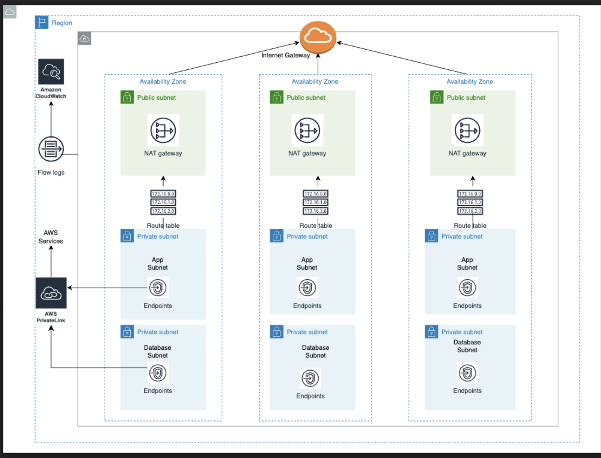

## Terraform AWS VPC

This module builds a VPC in the specified region.

## Architecture Diagram


## Prerequisites
- Terraform >=0.12
- AWS credentials setup
- ssh configured between your local machine and bitbucket.
- Git

## Basic usage
- Create a file e.g. vpc.tf with the following entries. Modify the input as needed.
- ```terraform init```
- ```terraform plan```
- ```terraform apply```

```
module "vpc" {
  source = "git@bitbucket.org:Protagona/aws-vpc.git?ref=main"

  name     = var.name
  vpc_cidr = var.cidr

  tags = {
    Project     = var.project
    Environment = var.environment
    Provisioner = "terraform"
  }
}
```


<!-- BEGIN_TF_DOCS -->
## Requirements

| Name | Version |
|------|---------|
| <a name="requirement_terraform"></a> [terraform](#requirement\_terraform) | >= 0.12 |

## Providers

| Name | Version |
|------|---------|
| <a name="provider_aws"></a> [aws](#provider\_aws) | n/a |

## Modules

No modules.

## Resources

| Name | Type |
|------|------|
| [aws_cloudwatch_log_group.log_group](https://registry.terraform.io/providers/hashicorp/aws/latest/docs/resources/cloudwatch_log_group) | resource |
| [aws_eip.ngw](https://registry.terraform.io/providers/hashicorp/aws/latest/docs/resources/eip) | resource |
| [aws_flow_log.flow_log](https://registry.terraform.io/providers/hashicorp/aws/latest/docs/resources/flow_log) | resource |
| [aws_iam_policy.vpc_flow_log_cloudwatch](https://registry.terraform.io/providers/hashicorp/aws/latest/docs/resources/iam_policy) | resource |
| [aws_iam_role.vpc_flow_log_cloudwatch](https://registry.terraform.io/providers/hashicorp/aws/latest/docs/resources/iam_role) | resource |
| [aws_iam_role_policy_attachment.vpc_flow_log_cloudwatch](https://registry.terraform.io/providers/hashicorp/aws/latest/docs/resources/iam_role_policy_attachment) | resource |
| [aws_internet_gateway.igw](https://registry.terraform.io/providers/hashicorp/aws/latest/docs/resources/internet_gateway) | resource |
| [aws_kms_alias.alias](https://registry.terraform.io/providers/hashicorp/aws/latest/docs/resources/kms_alias) | resource |
| [aws_kms_key.key](https://registry.terraform.io/providers/hashicorp/aws/latest/docs/resources/kms_key) | resource |
| [aws_nat_gateway.ngw](https://registry.terraform.io/providers/hashicorp/aws/latest/docs/resources/nat_gateway) | resource |
| [aws_route.private](https://registry.terraform.io/providers/hashicorp/aws/latest/docs/resources/route) | resource |
| [aws_route.public](https://registry.terraform.io/providers/hashicorp/aws/latest/docs/resources/route) | resource |
| [aws_route_table.private](https://registry.terraform.io/providers/hashicorp/aws/latest/docs/resources/route_table) | resource |
| [aws_route_table.public](https://registry.terraform.io/providers/hashicorp/aws/latest/docs/resources/route_table) | resource |
| [aws_route_table_association.private_app](https://registry.terraform.io/providers/hashicorp/aws/latest/docs/resources/route_table_association) | resource |
| [aws_route_table_association.private_db](https://registry.terraform.io/providers/hashicorp/aws/latest/docs/resources/route_table_association) | resource |
| [aws_route_table_association.public](https://registry.terraform.io/providers/hashicorp/aws/latest/docs/resources/route_table_association) | resource |
| [aws_subnet.app](https://registry.terraform.io/providers/hashicorp/aws/latest/docs/resources/subnet) | resource |
| [aws_subnet.db](https://registry.terraform.io/providers/hashicorp/aws/latest/docs/resources/subnet) | resource |
| [aws_subnet.public](https://registry.terraform.io/providers/hashicorp/aws/latest/docs/resources/subnet) | resource |
| [aws_vpc.vpc](https://registry.terraform.io/providers/hashicorp/aws/latest/docs/resources/vpc) | resource |
| [aws_vpc_endpoint.gateway_endpoints](https://registry.terraform.io/providers/hashicorp/aws/latest/docs/resources/vpc_endpoint) | resource |
| [aws_vpc_endpoint.interface_endpoints](https://registry.terraform.io/providers/hashicorp/aws/latest/docs/resources/vpc_endpoint) | resource |
| [aws_caller_identity.current](https://registry.terraform.io/providers/hashicorp/aws/latest/docs/data-sources/caller_identity) | data source |
| [aws_iam_policy_document.flow_log_cloudwatch_assume_role](https://registry.terraform.io/providers/hashicorp/aws/latest/docs/data-sources/iam_policy_document) | data source |
| [aws_iam_policy_document.kms_cloudwatch](https://registry.terraform.io/providers/hashicorp/aws/latest/docs/data-sources/iam_policy_document) | data source |
| [aws_iam_policy_document.vpc_flow_log_cloudwatch](https://registry.terraform.io/providers/hashicorp/aws/latest/docs/data-sources/iam_policy_document) | data source |
| [aws_region.current](https://registry.terraform.io/providers/hashicorp/aws/latest/docs/data-sources/region) | data source |

## Inputs

| Name | Description | Type | Default | Required |
|------|-------------|------|---------|:--------:|
| <a name="input_app_subnet_tags"></a> [app\_subnet\_tags](#input\_app\_subnet\_tags) | Optional map of extra tags for app subnets. | `map(string)` | `{}` | no |
| <a name="input_az_count"></a> [az\_count](#input\_az\_count) | The number of AZs to launch this VPC in | `number` | `3` | no |
| <a name="input_create_single_natgateway"></a> [create\_single\_natgateway](#input\_create\_single\_natgateway) | True if you want only a single nat gateway created | `bool` | `false` | no |
| <a name="input_db_subnet_tags"></a> [db\_subnet\_tags](#input\_db\_subnet\_tags) | Optional map of extra for db tags subnets. | `map(string)` | `{}` | no |
| <a name="input_enable_flow_logs"></a> [enable\_flow\_logs](#input\_enable\_flow\_logs) | If true, flow logs to CloudWatch will be enabled for the created VPC | `bool` | `true` | no |
| <a name="input_gateway_services"></a> [gateway\_services](#input\_gateway\_services) | List of AWS services to configure gateway vpc endpoints. This should exclude dynamodb. | `list(string)` | `[]` | no |
| <a name="input_interface_services"></a> [interface\_services](#input\_interface\_services) | List of AWS services to configure interface vpc endpoints. This should exclude s3 and lambda. | `list(string)` | `[]` | no |
| <a name="input_log_retention"></a> [log\_retention](#input\_log\_retention) | The time in days to retain flow logs. If this is set to 0 the logs will be retained indefinitely. | `number` | `30` | no |
| <a name="input_name"></a> [name](#input\_name) | Name of this VPC | `string` | n/a | yes |
| <a name="input_public_subnet_tags"></a> [public\_subnet\_tags](#input\_public\_subnet\_tags) | Optional map of extra tags for public subnets. | `map(string)` | `{}` | no |
| <a name="input_region"></a> [region](#input\_region) | Region to deploy this VPC | `string` | `"us-east-1"` | no |
| <a name="input_tags"></a> [tags](#input\_tags) | Optionally specify additional tags to add to the VPC. Please reference the [AWS Implementation Guide](https://security.rvdocs.io/guides/aws-implementation.html#required-tags) for more details on what tags are required | `map(string)` | `{}` | no |
| <a name="input_vpc_cidr"></a> [vpc\_cidr](#input\_vpc\_cidr) | CIDR block for this VPC | `string` | n/a | yes |

## Outputs

| Name | Description |
|------|-------------|
| <a name="output_app_subnet_cidrs"></a> [app\_subnet\_cidrs](#output\_app\_subnet\_cidrs) | Private subnet cidrs |
| <a name="output_app_subnet_ids"></a> [app\_subnet\_ids](#output\_app\_subnet\_ids) | Private subnet ids |
| <a name="output_db_subnet_cidrs"></a> [db\_subnet\_cidrs](#output\_db\_subnet\_cidrs) | Database subnet cidrs |
| <a name="output_db_subnet_ids"></a> [db\_subnet\_ids](#output\_db\_subnet\_ids) | Database subnet ids |
| <a name="output_nat_gateway_public_ips"></a> [nat\_gateway\_public\_ips](#output\_nat\_gateway\_public\_ips) | IP address of the nat gateway |
| <a name="output_public_subnet_cidrs"></a> [public\_subnet\_cidrs](#output\_public\_subnet\_cidrs) | Public subnet cidrs |
| <a name="output_public_subnet_ids"></a> [public\_subnet\_ids](#output\_public\_subnet\_ids) | Public subnet ids |
| <a name="output_vpc_cidr"></a> [vpc\_cidr](#output\_vpc\_cidr) | CIDR block of the VPC |
| <a name="output_vpc_id"></a> [vpc\_id](#output\_vpc\_id) | The VPC id |
<!-- END_TF_DOCS -->
